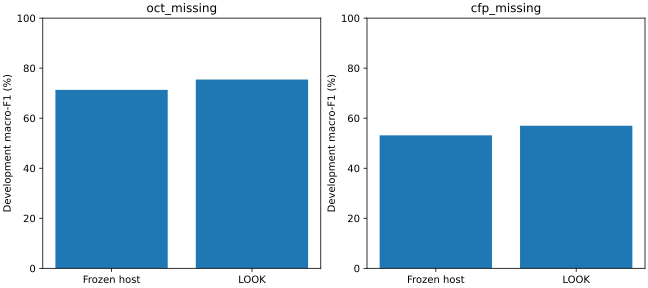

# LOOK：best-forward完整双缺失配置（累计入口）

2026-09-17 19:56 UTC核验。白内障、ResNet50、深层融合、seed3416，空间插值因子16（特征高宽分别除16，原图不缩小）、q32。开发集12,510人，其中807阳性；不使用test。best-forward每轮只接受最佳严格正收益位置，再搜索其下游；当前主方法positive_forward_tree另行运行，不能混称。

|场景|未修正macro-F1 %|修正后 %|差值pp|普通95%区间pp|本配置两比较同时95%区间pp|最终路径|候选评价数|
|---|---:|---:|---:|---|---|---|---:|
|缺OCT|71.3331|75.4662|+4.1330|[2.8357,5.4366]|[2.6669,5.5991]|fusion_participant_feature|9|
|缺CFP|53.1402|56.9855|+3.8453|[2.5063,5.2221]|[2.3022,5.3884]|joint_stem → joint_stage3|20|

缺CFP路径：53.1402% → 56.0178% → 56.9855%，随后所有剩余候选无严格正收益而停止；末端候选55.7258%被拒绝，最终保留56.9855%。因此并非任何缺失状态都必然首轮选末端。两个方向的最优路径不同，是本宿主/种子/开发集条件下的观察。

## 收益与反例同时报告

缺OCT AUROC由81.7807%升至82.9892%。缺CFP虽然macro-F1提高，AUROC却从69.0933%降至67.9745%，accuracy从93.2294%降至90.1279%，NLL从0.2500升至0.3370，Brier从0.1311升至0.1922。病例敏感度由5.70%升至18.22%，但阴性误报由86增至575。不能把按macro-F1选优解释为全面改善排序、校准或临床价值。

10,000次参与者级配对bootstrap，同一参与者顺序，区间属于这一个配置的两个缺失比较；不是全研究同时区间。dev参与路径选择，区间没有消除选择偏差，不是独立确认性证据。单种子完整配置也不是有限周包完成，不放行其他种子。

## 成本与图解释

记录累计执行约7.23小时（含恢复/迁移引用，非从零重跑公平计时）；GPU峰值保留约3.45GiB、进程RSS约2.08GiB。当前29次候选评价不代表全部从零计算。不能据此直接断言比树或顺序策略更快。

横轴是未修正冻结宿主和best-forward修正；纵轴为dev macro-F1百分比，越高越好；左图缺OCT，右图缺CFP。此图只展示点估计，区间见上表；它不展示上述AUROC与校准反例，须结合文字和[完整指标](results.json)阅读。

## 验收与来源

run `2026_09_17_15_28_21_422026`，科学源 `ec4dc8f05b20d38de89abfb7a39d5ec0784780bc`。远端已自动完成预测重放、报告及累计publication；本轮另核验247项科研文件SHA、5项交付文件SHA与交付输入绑定，并从四份预测独立重算macro-F1和混淆矩阵，参与者/标签顺序一致。详细受限资产留Ibex，不进入GitHub。

运维复核：`OPS/look_next_fusion_20260917_v1/owner_v6/best_forward_completed_audit_1958.json`；OPS指当前handoff绑定的操作目录。当前主树缺CFP仍在评价，缺OCT树已接受的单状态结果保持原记录。下一步完成主树双状态重放/报告，再形成两策略同条件比较，四代表起点及后续融合位置仍按既定依赖推进。
