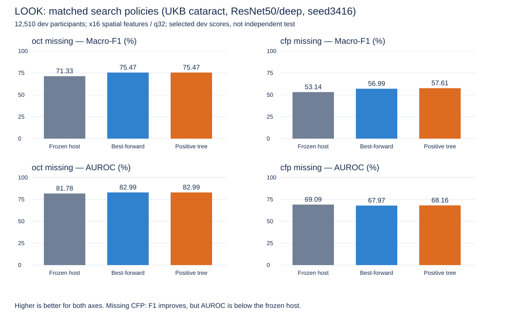

# LOOK：搜索策略累计比较

核验截止2026-09-18 03:45 UTC。白内障、ResNet50双分支深层融合宿主、3416；train拟合、dev选优，12,510名dev参与者（807阳性）。空间特征高宽各除16，q32；网络输入未缩小。原宿主预测和参与者/标签顺序已跨策略逐项核验一致。

| 缺失状态 | 不修正 | best-forward | 正收益树（当前主线） | 树相对不修正 | 树相对best-forward |
|---|---:|---:|---:|---:|---:|
| 缺OCT | 71.3331% | 75.4662% | 75.4662% | +4.1330 pp | 0.0000 pp |
| 缺CFP | 53.1402% | 56.9855% | 57.6058% | +4.4656 pp | +0.6203 pp |

数值为macro-F1。best-forward每轮只保留最优正收益下游扩展；正收益树保留每个位置自身最优且对当前前缀严格提升的扩展，逐分支继续，再按预定dev规则选最终路径。两者均拒绝无正收益扩展，后续拟合使用已接受修正后的特征。原始候选、拒绝记录与路径均留在受限存储。

图横轴为冻结宿主、best-forward、正收益树；纵轴均为百分比且从0开始。上排macro-F1、下排AUROC，均越高越好。左右分别缺OCT/缺CFP。图为点估计，不能用柱高差声称策略间显著差异。后续同范围结果更新同一表、图及[图源](comparison.json)。

## 路径与计算量

| 状态 | best-forward路径 / 候选数 | 正收益树路径 / 候选数 / 完成前缀 |
|---|---|---|
| 缺OCT | 参与者融合特征 / 9 | 参与者融合特征 / 17 / 8 |
| 缺CFP | stem→stage3 / 20 | stem→stage1→stage3 / 40 / 12 |

这次缺CFP保留非首轮最佳的中间扩展后找到了更高dev分数；缺OCT多分支没有提高最终分数。因此不能说末层必然最好，也不能说树在所有情形都有收益。

此次登记的执行墙时：best-forward约7.23小时，树约12.69小时；两者均有迁移/缓存复用，且共卡负载不同，**不是公平冷启动速度基准**。逻辑候选数29→57可直接描述搜索量，不能以此推导所有模型时间比例。当前树只比较PCA/GCV算子，不代表完整仿射家族已覆盖。

## 指标代价与区间

缺CFP：不修正→best-forward→树的AUROC为69.0933%→67.9745%→68.1612%；NLL为0.2500→0.3370→0.3567，Brier为0.1311→0.1922→0.2071（后两项越低越好）。树的阳性检出178/807，相对原宿主46/807增加，但假阳性86→713。F1改善不等于整体预测或临床效用全面改善。

树相对不修正的10,000次参与者级配对bootstrap普通95%差值区间：缺OCT[2.8717,5.4297]pp，缺CFP[3.0359,5.8856]pp；本配置双比较族近似同时区间分别[2.6643,5.6018]、[2.8326,6.0987]pp。仅为同一dev选优后的描述，未消除选择偏差。**尚未对树与best-forward的0.6203pp差值做独立确认，不能称统计优越。**

## 验收与边界

远端自动完成冻结核验、重放、统计与累计publication；独立核验392份科研文件和5份交付文件SHA、报告输入绑定、四份最终预测的参与者/标签顺序、macro-F1和混淆矩阵、选中路径权重SHA。证据：当前OPS的`look_next_fusion_20260917_v1/owner_v6/tree_completed_audit_20260918.json`。run为`2026_09_17_17_13_09_376989`，科学源码`08bf6ccf503e0073afa96ed3fd1f933219d88682`。

这是**一个宿主/种子的双缺失完整配置**，不是整周研究包、三种子或test完成。四代表起点、其他融合宿主及线性家族仍待其各自实际执行验收；新申请接续已绑定不代表这些任务已经开始。test封存、重复种子门槛保持。下一主线仍为匹配控制与后续宿主，保持原身份和共享缓存。

[树原始聚合指标](tree/results.json) · [树配对统计](tree/paired_statistics.json) · [此前best-forward完整报告](../best_forward/README.md)
